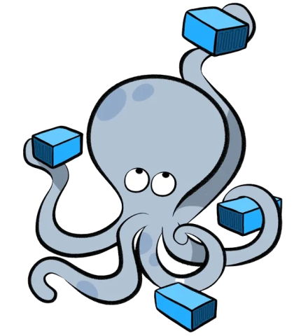
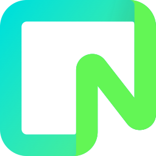

# Lynx Docs


---

[](https://codspeed.io/AReid987/lynx)

## Introduction

## Monorepo App Architecture

### Technology

| Build System | Icon | Package Managers | Icon |
| --- | --- | --- | --- |
| Turborepo  |  | uv |  |
| Hatchling |  | pnpm |  |
| ---------------- | -------- | ---------------- | -------- |
| **UI**      | **Icon** | **Backend**     | **Icon** |
| Motion      |  |Python      |     |
| Shadcn UI   |  | FastAPI     |  |
Radix       |     |
| TailwindCSS |  |
| ---------------- | -------- | ---------------- | -------- |
| **Containerization** | **Icon** | **Database** | **Icon** |
| Docker       |  | Drizzle     |   |
| Docker Compose |  | PostgreSQL  |  |
| | | Neon        |  |
| | | Cassandra   |  |
| ---------------- | -------- | ---------------- | -------- |
| **Network** | **Icon** | **DevOps** | **Icon** |
| Tailscale      |  |
| ---------------- | -------- | ---------------- | -------- |
| **Apps** | **Icon** | **Packages** | **Icon** |
| **lynx-agent**: A Next.js Interface for **data-lynx** |  | **ui**: React shared component library |  |
| **docs**: A Next.js / Nextra web App for project documentation |  | **typescript-config**: Shared tsconfig configurations used throughout the monorepo  | |
| **data-lynx**: A modular Multi Agent System |  | **eslint-config**: eslint configurations (includes eslint-config-next, eslint-config-prettier other configs used throughout the monorepo) |  |

---

<!-- TODO -->

## Contributing

#### Option 1:

Change into the web directory:

```bash
cd apps/lynx-agent
```

run the development server:

```bash {"id":"01JKJHYDTCKD8H997ZW2JADJ90"}
pnpm dev
```

#### Option 2:

From anywhere in the repo

```bash
pnpm dev --filter=@lynx/lynx-agent
```

Open [http://localhost:3000](http://localhost:3000) with your browser to see the result.

Edits will automatically reload the page.
You will see any output or errors in the console.

**Project structure:**

**Turborepo**

 . <br />
|--  apps <br />
|    |--  docs <br />
|    |--  kwg <br />
|    |--  lynx-agent <br />
|    |--  data-lynx <br />
|    |--  icons <br />
|--  node_modules <br />
|--  package.json <br />
|--  packages <br />
|   |--  eslint-config <br />
|   |--  typescript-config <br />
|   |--  ui <br />
|--  pnpm-lock.yaml <br />
|--  pnpm-workspace.yaml <br />
|--  project_documenation <br />
|   |--  biz-dev <br />
|   |--  design-system <br />
|   |--  development <br />
|   |--  project-management <br />
|   |--  prompts <br />
|   |--  system-design <br />
|--  README.md <br />
|--  reference-architecture <br />
|   |--  astra-db <br />
|   |--  c4-system-context <br />
|   |--  d2 <br />

**lynx-agent**

- `app/`: Contains the main application code.
- `public/`: Contains static assets like images and fonts.
- `app/globals.css`: Contains global CSS styles.

<!-- - `components/`: Contains reusable React components. -->

**Home page:**

- `app/page.tsx`.

This project uses [`next/font`](https://nextjs.org/docs/app/building-your-application/optimizing/fonts) to automatically optimize and load custom fonts. 
- Fonts sourced from Google Fonts & [Fontshare.com](https://www.fontshare.com/)

**Resources**
- [Next.js Documentation](https://nextjs.org/docs) - learn about Next.js features and API.
- [Learn Next.js](https://nextjs.org/learn) - an interactive Next.js tutorial.

You can check out [the Next.js GitHub repository](https://github.com/vercel/next.js) - your feedback and contributions are welcome!

### Deployment

Both lynx-agent and the Lynx Documentation are deployed on the [Vercel Platform](https://vercel.com/new?utm_medium=default-template&filter=next.js&utm_source=create-next-app&utm_campaign=create-next-app-readme).

---

## runme:

id: 01JKJKJ0VT53WQAT94SD3AGGVE
version: v3

# lynx-agent

This is a [Next.js](https://nextjs.org/) WebUI for Lynx, the AI Agent.

## Features

- This feature list doubles as a Roadmap for the project.
- Items are checked as they become implemented.

### UI

- [ ] **User Authentication:** Secure user login and registration.
- [ ] **Dashboard:** Overview of AI Agent activities and performance.
- [ ] **Task Management:** Create, manage, and track tasks.
- [ ] **Real-time Updates:** Live updates on task progress and AI Agent status.
- [ ] **Settings:** Customize your experience and preferences.

### Lynx CRM

- [ ] **ICP Generation**: Generate and manage ICP (Intelligent Customer Profiles).
- [ ] **Lead Management:** Create, view, and manage leads.
- [ ] **Contact Management:** Store and manage contact information.
- [ ] **Sales Pipeline:** Track sales opportunities and progress.
- [ ] **Reporting:** Generate reports on sales performance and other metrics.
- [ ] **Analytics:** Gain insights into customer behavior and trends.
- [ ] **Integration:** Seamless integration with other tools and services.
- [ ] **Settings:** Customize your CRM experience and preferences.

## Deployed on Vercel
