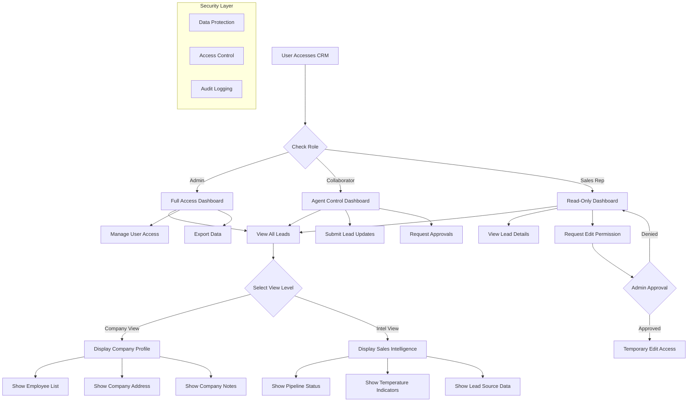

```mermaid
graph TD
    A[User Accesses CRM] --> B{Check Role}
    B -->|Admin| C[Full Access Dashboard]
    B -->|Collaborator| D[Agent Control Dashboard]
    B -->|Sales Rep| E[Read-Only Dashboard]
    
    C --> F[View All Leads]
    D --> F
    E --> F

    F --> G{Select View Level}
    G -->|Company View| H[Display Company Profile]
    G -->|Intel View| I[Display Sales Intelligence]
    
    H --> J[Show Employee List]
    H --> K[Show Company Address]
    H --> L[Show Company Notes]
    
    I --> M[Show Pipeline Status]
    I --> N[Show Temperature Indicators]
    I --> O[Show Lead Source Data]
    
    C --> P[Manage User Access]
    C --> Q[Export Data]
    
    D --> R[Submit Lead Updates]
    D --> S[Request Approvals]
    
    E --> T[View Lead Details]
    E --> U[Request Edit Permission]
    
    U --> V{Admin Approval}
    V -->|Approved| W[Temporary Edit Access]
    V -->|Denied| E
    
    subgraph Security Layer
        X[Data Protection]
        Y[Access Control]
        Z[Audit Logging]
    end
```