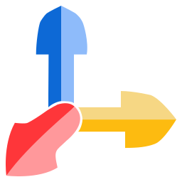

#  Langflow

##  Workflow

### 1. Structured Input

- Initial Input is structured
- Variables are in place to be filled in when called
- Enables dynamic, reusable
- workflows

####  Variables

`{state}`
`{cities}`
`{job_titles}`
`{pharmacy_keywords}`

### 2. Search Engines

- A Collection of search engines is used to search for information
- Searches are based on the structured input

####  Brave Search API

- 1 Request per second
- 2000 free searches per month

####  Tavily API

- 100 Requests per minute
- 1000 API Credits / Month

#####  **Search**

| Search Depth | API Credits |
| ------------ | ----------- |
| basic        | 1           |
| advanced     | 2           |

#####  **Extract**

| Extract Depth | Successfully Extracted URLS | API Credits |
| ------------- | --------------------------- | ----------- |
| basic         | 0                           | 0           |
| basic         | 5                           | 1           |
| advanced      | 0                           | 0           |
| advanced      | 5                           | 2           |

####  SerpAPI

- 100 Requests per Month
- Many options for APIs to call
   - e.g., Google Trends API, Apple Store API, Home Depot API, etc
   - 🔗 [serpAPI Search API Docs](https://serpapi.com/search-api)

#####  **Planned Usage**:

- Deeper Searches for more specific data

###  Exa

####  **Planned Usage**:

- [docs](https://docs.exa.ai)

- Research Assistant
- Competitor Analysis

###  Competitor Analysis

- Convergence Proxy
- Open Operator
- Exa
- BrwzrCTRL
