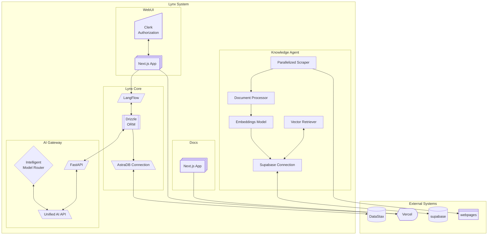

```mermaid
      flowchart TD
            subgraph WebUI["WebUI"]
                  web_ui["Next.js App"]
                  clerk["Clerk 
                  Authorization"]
            end
            subgraph Docs["Docs"]
                  docs["Next.js App"]
            end
            subgraph Lynx_Core["Lynx Core"]
                  drizzle_orm["Drizzle 
                  ORM"]
                  lynx_core["LangFlow"]
                  dataConnector["AstraDB Connection"]
            end
            subgraph AI_Gateway["AI Gateway"]
                  unified_api["Unified AI API"]
                  ai_gateway["FastAPI"]
                  model_router["Intelligent 
                  Model Router"]
            end
            subgraph Knowledge_Agent["Knowledge Agent"]
                  supabase_connection["Supabase Connection"]
                  parallel_scraper["Parallelized Scraper"]
                  document_processor["Document Processor"]
                  embeddings["Embeddings Model"]
                  vector_retriever["Vector Retriever"]
            end
            subgraph Lynx_System["Lynx System"]
                  WebUI
                  Docs
                  Lynx_Core
                  AI_Gateway
                  Knowledge_Agent
            end
            subgraph External_Systems["External Systems"]
                  datastax["DataStax"]
                  vercel["Vercel"]
                  supabase["supabase"]
                  webpages["webpages"]
            end
            clerk <--> web_ui
            lynx_core <--> drizzle_orm
            drizzle_orm --> dataConnector
            model_router <--> unified_api
            ai_gateway <--> unified_api
            web_ui --> lynx_core & vercel
            docs --> vercel
            dataConnector <--> datastax
            drizzle_orm <--> ai_gateway
            supabase_connection <--> supabase
            parallel_scraper --> webpages
            parallel_scraper --> document_processor
            document_processor --> embeddings
            embeddings --> supabase_connection
            vector_retriever <--> supabase_connection

            web_ui@{ shape: procs}
            clerk@{ shape: manual-input}
            docs@{ shape: procs}
            drizzle_orm@{ shape: subproc}
            lynx_core@{ shape: in-out}
            dataConnector@{ shape: out-in}
            unified_api@{ shape: out-in}
            ai_gateway@{ shape: in-out}
            model_router@{ shape: decision}
            datastax@{ shape: db}
            vercel@{ shape: display}
            supabase@{ shape: db}
            webpages@{ shape: div-proc}
```

